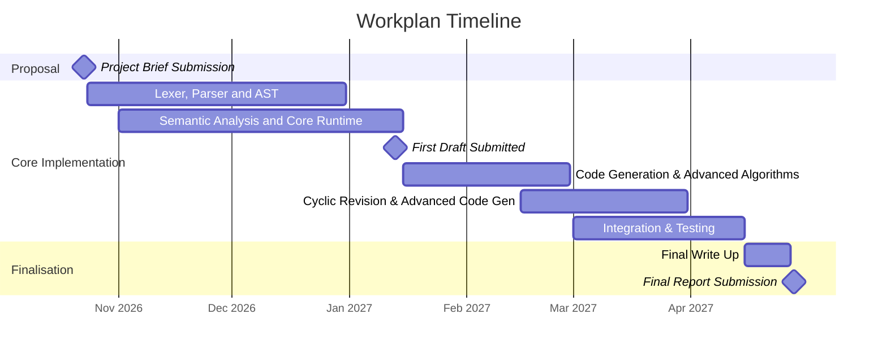

```mermaid
gantt
    title Workplan Timeline
    dateFormat  YYYY-MM-DD
    axisFormat  %b %Y
    todayMarker off

    section Proposal
    Project Brief Submission                 :milestone, m1, 2026-10-23, 0d

    section Core Implementation
    Lexer, Parser and AST                    :a1, 2026-10-24, 2026-12-31
    Semantic Analysis and Core Runtime       :a2, 2026-11-01, 2027-01-15
    First Draft Submitted                    :milestone, m2, 2027-01-13, 0d
    Code Generation & Advanced Algorithms    :a3, 2027-01-15, 2027-02-28
    Cyclic Revision & Advanced Code Gen      :a4, 2027-02-15, 2027-03-31
    Integration & Testing                    :a5, 2027-03-01, 2027-04-15

    section Finalisation
    Final Write Up                           :a6, 2027-04-15, 2027-04-27
    Final Report Submission                  :milestone, m3, 2027-04-28, 0d
```
